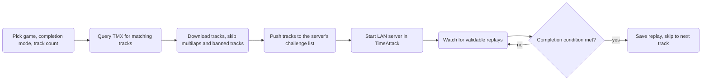

# Nostalgic Completionist

**Nostalgic Completionist** is a console app that speeds up track completion on old TrackMania games that have limitations which [Randomizer Anywhere](https://github.com/BigBang1112/randomizer-anywhere) cannot solve. It connects to your already-running game over its built-in GBXRemote interface, pulls a batch of random tracks from [TMX](https://tm-exchange.com/), queues them up on a LAN server, and automatically advances to the next track once you save a replay on them.

**For TrackMania Nations ESWC, make sure your game is already opened before running this app, otherwise the game will just show green background.** This is a bug within the game itself.

**This randomizer does not support Stunts, Platform, and multilap tracks.**

## Completion modes

| Mode | Description |
| --- | --- |
| `Finish` | Unfinished tracks, auto-skip on saved replay |
| `AuthorMedal` | Unbeaten AT tracks, auto-skip on saved replay that beats the AT |

## Supported games

| Game | TMX site |
| --- | --- |
| TrackMania Nations ESWC (TMN) | nations.tm-exchange.com |
| TrackMania Sunrise eXtreme (TMS) | sunrise.tm-exchange.com |
| TrackMania Original (TMO) | original.tm-exchange.com |

## Explanation

The main problem that Randomizer Anywhere cannot solve is that TrackMania Sunrise and TrackMania Original clients cannot enqueue new maps into the session in real time. User needs to have them visible in game using the Refresh button, and there's no easy way to trigger the refresh either. This is why this app downloads a batch of tracks and pushes them to the track list all at once, and requests pressing the Refresh button in track browser in case it cannot add them. *Such issue does not exist in TrackMania Nations ESWC.*

A dedicated server can solve this issue for TMSunrise and TMOriginal, but it doesn't provide any way for the user to save a replay that is validable and uploadable to TMX. This problem applies to TMNations ESWC as well.

Clients also don't support callbacks, which is the standard way of detecting a player finishing a track, so the app instead watches for saved replays in the game's replay folder to determine completion.

So this app is a heavy compromise, mainly useful for TMSunrise and TMOriginal.

## How it works

To ensure that the tracks are downloaded in bulk efficiently and that the users are less likely to receive same maps between each other, the app queries TMX in batches of 100 tracks at a time (every 10 requested tracks), and randomly picks 10 of them, additionally applying ban and multilap filters.

## Ban list

Each supported game gets its own ban file at `Bans/<Game>.txt`, created automatically on first run. Add a TMX track ID per line (optionally followed by a space and a comment as to why it's banned) to permanently exclude that track from future sessions.

## Replays

Every replay accepted for the active session is copied to `Replays/<session-date>/`, so that it's easier to upload them to TMX.

## Special thanks

To the TMX maintainers that make this possible!